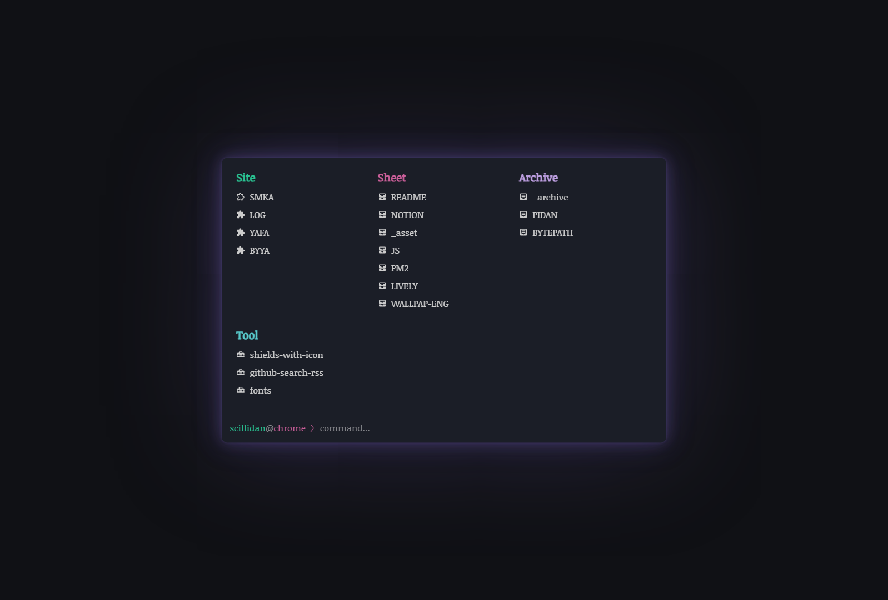
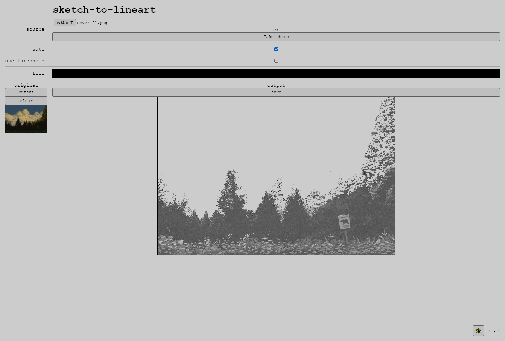

| group | source | license | tested | readme | preview |
|---|---|---|---|---|---|
| web | [reminiflux](//github.com/reminiflux/reminiflux) |  |  | [.md](_readme/reminiflux.md) |  |
| web | [Excalith Start Page](//github.com/excalith/excalith-start-page) |  |  | [.md](_readme/excalith-start-page.md) |  |
| epub | [Manga Repack](//github.com/Aeroblast/MangaRepack) |  |  | [.md](_readme/mangarepack.md) |  |
| epub | [EPUB Manga Creator](//github.com/wing-kai/epub-manga-creator) |  |  | [.md](_readme/epub-manga-creator.md) |  |
| epub | [ePubViewer](//github.com/pgaskin/ePubViewer) |  |  | [.md](_readme/epubviewer.md) |  |
| pdf | [docTR](//github.com/mindee/doctr) |  |  | [.md](_readme/doctr.md) |  |
| pdf | [Localpdf.tech](//github.com/julianfbeck/localpdfmerger) |  |  | [.md](_readme/localpdfmerger.md) |  |
| pdf | [Rearrange PDF as Duplex Scan](//github.com/clemensheithecker/pdf-duplex-scan) |  |  | [.md](_readme/pdf-duplex-scan.md) |  |
| pdf | [Look Scanned](//github.com/rwv/lookscanned.io) |  |  | [.md](_readme/lookscanned-io.md) |  |
| pdf | [pdf-margins](//github.com/ToyVo/pdf-margins) |  |  | [.md](_readme/pdf-margins.md) |  |
| pdf | [pdfme-playground](//github.com/pdfme/pdfme-playground) |  |  | [.md](_readme/pdfme-playground.md) |  |
| pdf | [Album App for Django](//github.com/jobsta/albumapp-django) |  |  | [.md](_readme/albumapp-django.md) |  |
| pdf | [ReportBro Designer](//github.com/jobsta/reportbro-designer) |  |  | [.md](_readme/reportbro-designer.md) |  |
| pdf | [Vivliostyle Viewer](//github.com/vivliostyle/vivliostyle.js/tree/master/packages/viewer) |  |  | [.md](_readme/vivliostyle-viewer.md) |  |
| pdf | [pdf.js](//github.com/mozilla/pdf.js) |  |  | [.md](_readme/pdfjs.md) |  |
| ico | [Favycon](//github.com/ruisaraiva19/favycon) |  |  | [.md](_readme/favycon.md) |  |
| svg | [Url encoder for SVG](//github.com/yoksel/url-encoder) |  |  | [.md](_readme/url-encoder.md) |  |
| svg | [Satori](//github.com/vercel/satori) |  |  | [.md](_readme/satori.md) |  |
| svg | [hot-chain-svg](//github.com/w1nt3r-eth/hot-chain-svg) |  |  | [.md](_readme/hot-chain-svg.md) |  |
| svg | [SVGOMG](//github.com/jakearchibald/svgomg) |  |  | [.md](_readme/svgomg.md) |  |
| svg | [SVGEdit](//github.com/SVG-Edit/svgedit) |  |  | [.md](_readme/svgedit.md) |  |
| svg | [SvgPathEditor](//github.com/Yqnn/svg-path-editor) |  |  | [.md](_readme/svg-path-editor.md) |  |
| svg | [Vtracer Web App](//github.com/visioncortex/vtracer) |  |  | [.md](_readme/vtracer-webapp.md) |  |
| img | [JS IMAGE CARVER](//github.com/trekhleb/js-image-carver) |  |  | [.md](_readme/js-image-carver.md) |  |
| img | [visionmagic](//github.com/visioncortex/visionmagic) |  |  | [.md](_readme/visionmagic.md) |  |
| img | [sketch-to-lineart](//github.com/seleb/sketch-to-lineart) |  |  | [.md](_readme/sketch-to-lineart.md) |  |
| img | [ordered-dither-maker](//github.com/seleb/ordered-dither-maker) |  |  | [.md](_readme/ordered-dither-maker.md) |  |
| img | [Streamlit Image Crop](//github.com/mitsuse/streamlit-image-crop) |  |  | [.md](_readme/streamlit-image-crop.md) |  |
| img | [image-editor](//github.com/andrepv/image-editor) |  |  | [.md](_readme/image-editor.md) |  |
| diag | [altium.js](//github.com/gsuberland/altium_js) |  |  | [.md](_readme/altium_js.md) |  |
| diag | [Flowchart Fun](//github.com/tone-row/flowchart-fun) |  |  | [.md](_readme/flowchart-fun.md) |  |
| diag | [REAFLOW](//github.com/reaviz/reaflow) |  |  | [.md](_readme/reaflow.md) |  |
| diag | [quiver](//github.com/varkor/quiver) |  |  | [.md](_readme/quiver.md) |  |
| diag | [tikzcd-editor](//github.com/yishn/tikzcd-editor) |  |  | [.md](_readme/tikzcd-editor.md) |  |
| diag | [Drawflow](//github.com/jerosoler/Drawflow) |  |  | [.md](_readme/drawflow.md) |  |
| diag | [Mermaidv Live Editor](//github.com/mermaid-js/mermaid-live-editor) |  |  | [.md](_readme/mermaid-live-editor.md) |  |
| diag | [Excalidraw](//github.com/excalidraw/excalidraw) |  |  | [.md](_readme/excalidraw.md) |  |
| font | [Programming Fonts](//github.com/braver/programmingfonts) |  |  | [.md](_readme/programmingfonts.md) |  |
| kbd | [Reference](//github.com/Fechin/reference) |  |  | [.md](_readme/reference.md) |  |
| kbd | [Cheatsheet Generator](//github.com/nathanlesage/cheatsheet-generator) |  |  | [.md](_readme/cheatsheet-generator.md) |  |
| trkr | [Guitar Editor](//github.com/haixiangyan/guitar-tabs-editor) |  |  | [.md](_readme/guitar-tabs-editor.md) |  |
| trkr | [Guitar Tab Editor](//github.com/calesce/tab-editor) |  |  | [.md](_readme/tab-editor.md) |  |
| edit | [lrc_editor](//github.com/yiyizym/lrc_editor) |  |  | [.md](_readme/lrc_editor.md) |  |
| edit | [Codi.link](//github.com/midudev/codi.link) |  |  | [.md](_readme/codi-link.md) |  |
| edit | [Editor](//github.com/markhillard/Editor) |  |  | [.md](_readme/editor.md) |  |
| edit | [RegExr](//github.com/gskinner/regexr) |  |  | [.md](_readme/regexr.md) |  |
| edit | [potluck (demo)](//github.com/inkandswitch/potluck) |  |  | [.md](_readme/potluck.md) |  |
| calc | [CL Calc](//github.com/ovk/clcalc) |  |  | [.md](_readme/clcalc.md) |  |
| calc | [Notepad Calculator Prototype](//github.com/SteveRidout/notepad-calculator) |  |  | [.md](_readme/notepad-calculator.md) |  |
| calc | [Calcutext](//github.com/jaredreich/calcutext) |  |  | [.md](_readme/calcutext.md) |  |
| calc | [NoteCalc](//github.com/bbodi/notecalc3) |  |  | [.md](_readme/notecalc3.md) |  |
| clk | [FocusTide](//github.com/Hanziness/FocusTide) |  |  | [.md](_readme/focustide.md) |  |
| clk | [woah!](//github.com/pabueco/woah) |  |  | [.md](_readme/woah.md) |  |
| tool | [QR code designer](//github.com/kochrt/qr-designer) |  |  | [.md](_readme/qr-designer.md) |  |
| tool | [markdownlint](//github.com/DavidAnson/markdownlint) |  |  | [.md](_readme/markdownlint.md) |  |
| tool | [Snippet Box](//github.com/pawelmalak/snippet-box) |  |  | [.md](_readme/snippet-box.md) |  |